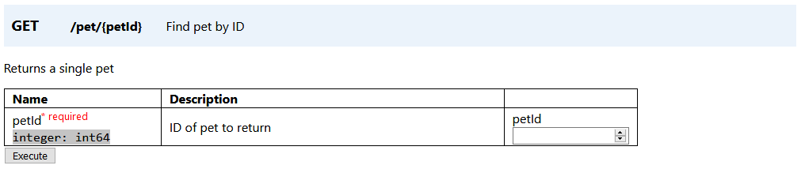
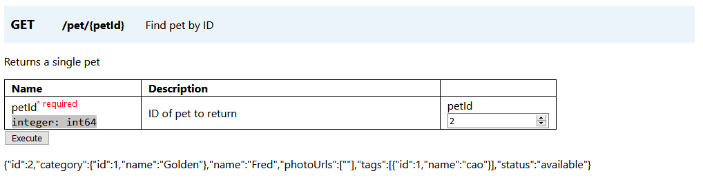
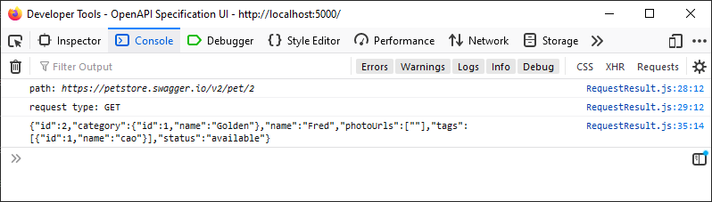

This project was bootstrapped with [Create React App](https://github.com/facebook/create-react-app).

# openapi-ui

A UI to read OpenAPI specification files and provide a UI to make requests to the API.

Requires Node to be installed to run this app.

### To run: 

`npm install -g serve`

`serve -s build`

For more information on how to deploy, see: https://facebook.github.io/create-react-app/docs/deployment.

## Usage

1. Select an OpenAPI specification file. Provided files in the build folder include `petstore-simple.json`,
`swagger2.json`, and `swagger3.json`. This project was tested with `swagger3.json`. Other specification files
may not work completely.

2. Select the endpoint `GET /pet/{petId}`. This endpoint has been tested to work. Other endpoints are not guaranteed
to work properly.

3. Enter a value for `petId` and click "Execute". In my testing, a `petId` of `2` works.

To verify that the API request is working, open the console. The response text is logged to the console.

See http://petstore.swagger.io/ for reference. `swagger3.json` is based on the specification file used on this site.
